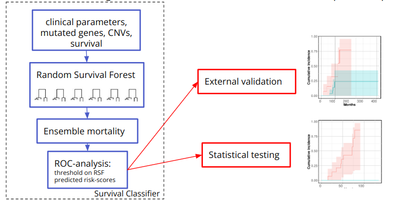

# rsf_project_progression_to_sWM
Integrating Clinical and Genomic Data for studying progression to sWM using random survival forests.

Integrating clinical and genomic data provides a more comprehensive framework for predicting disease progression and patient outcomes. In our cohort, we observe a broad spectrum of mutations across multiple genes, and in many cases, individual features or small groups of features are insufficient to distinguish between underlying patient classes. This variability introduces challenges in capturing non-linear relationships and complex interactions among features. To address these complexities, we employ random survival forests (RSFs), a machine learning approach tailored for survival data. RSFs, an extension of random forests, are effective for examining patient outcomes over time, allowing us to model disease progression or non-progression while accounting for right-censored data.

RSFs construct hundreds to thousands of decision trees, each of which uses a random subset of clinical and mutational predictors to stratify patients into subgroups with similar survival outcomes. This ensemble-based method aggregates the outputs of all trees to provide each patient with a predicted risk of progression. RSFs are advantageous because they automatically handle non-linear effects and feature interactions through their multi-decision-tree structure. Randomization of samples and predictors, for each tree and split further reduces overfitting risk, supporting the generalizability of the model. Additionally, RSFs offer a robust metric for variable importance: the "minimal depth of maximal subtree," which provides insight into the significance of individual predictors within the model.

In this study, we focus on the mutational status of 42 genes and 10 CNVs mutated in our cohort of WM precursor patients. By leveraging RSFs (using the randomForestSRC R package), we try to identify genetic features that are highly predictive of patient outcomes, ranking both clinical and genomic variables by their impact on survival. Given the small size of our cohort (64 patients, with only 9 progressing within the study period), we use RSFs in order to enhance our understanding of disease progression, to uncover key variables and preliminary survival patterns within our cohort. First, RSFs provide a ranking of features (both clinical and genomic) by their association with progression times, enabling us to pinpoint specific genes or clinical markers that seem to be closely linked to disease progression. Second, RSFs generate individual survival curves for each patient, offering a visual representation of the probability of remaining progression-free over time. Comparing these curves for progressing and non-progressing patients helps to identify general patterns, even within a limited dataset. Finally, the variable importance results from the RSF can be used to stratify patients into risk groups based on influential features. We stratified patients into 2 groups: high and low risk to progression groups, based on ROC-analysis results on the RSF predicted scores. Kaplan-Meier survival curves for these groups can reveal distinct survival patterns and offer initial insights into potential risk factors.

Of course, with a larger sample size RSFs can be used for training robust classifiers.

We have used a validation cohort to further test the generalizability of our models. The validation cohort patients’ clinical measurements and genomic events were used as input to the models and we have used the same thresholds to stratify them into the high or low risk to progression group. We then fit a Cox proportional hazards model to assess the association between risk groups and progression-free survival in the validation cohort. To visualize group-level differences in survival, we also generated Kaplan–Meier survival curves.

Overview figure Inspired by: Ruffalo et al., Journal of Biomedical Informatics https://doi.org/10.1016/j.jbi.2015.10.003.



Create a new Conda environment named rsf_env using the dependencies listed in requirements.txt:

````
conda create --name rsf_env --file requirements.txt
````

Activate the environment (if not already active):

````
conda activate rsf_env
````

Execute the R script model_clinValues_genomic.R

````
Rscript model_clinValues_genomic.R
````


If you want to use the model and get a predisction on your patient data, create a csv file like the one: rsf_project_progression_to_sWM/data/validation_cohort.tsv . Do NOT include missing values such as NA, Nan etc. Open an R session when having activated the rsf_env.
````
# # Load the RSFclin+genomic model
obj <- readRDS("path/to/models/obj_model3_clinValues_genomic.RDS")

# Data
d <- read.table("/path/to/data/patient_data.tsv", header = TRUE, row.names = 1)

y.pred <- predict(obj, newdata = d)

# predicted scores
y.pred$predicted
````

The presicted risk scores are printed in the same order the patients are provided in the data table. After ROC-analysis we have used the threshold 1.09 to stratify patients into high or low risk-to progression groups.
